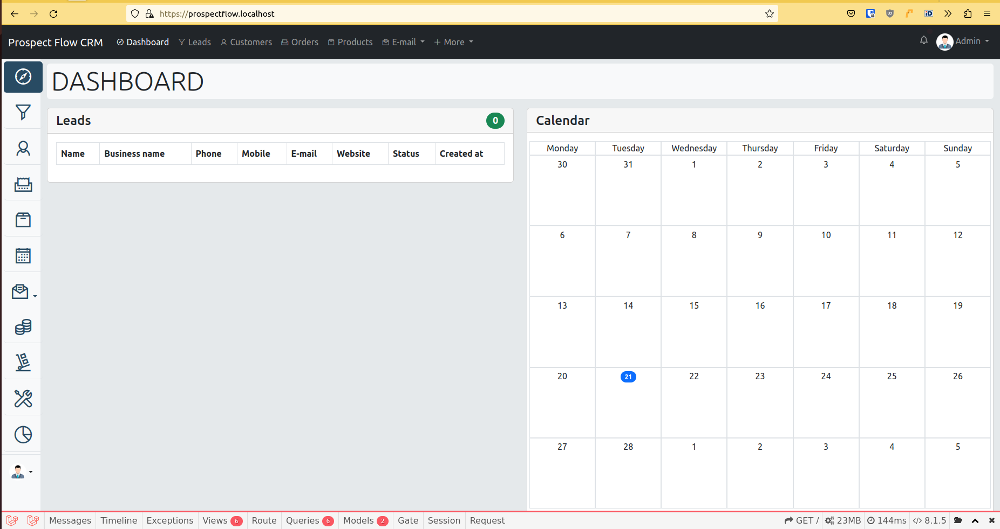

# Prospero Flow CRM
We made a free open source CRM. Our Community Edition (CE) 
- Prospero Flow CRM is based in Laravel 10

## Requirements
* PHP >= 8.3
* composer
* Laravel 10
* MariaDB / Postgres / MS SQL Server
* Redis

## Features
* Multi company (White label)
* Multi language
* REST API

[](https://sonarcloud.io/summary/new_code?id=Roskus_prospero-flow-crm)

## Setup

### Clone the project:
```bash
git clone git@github.com:Roskus/prospero-flow-crm.git
```

### Migrate from hammer to prospero-flow-crm repo
```bash
git remote set-url origin git@github.com:Roskus/prospero-flow-crm.git
```

### Docker Setup in 1 command
```bash
make install
```

### Setup docker
```bash
docker-compose -f docker-compose.yml -f docker-compose.mysql.yml -f docker-compose.pma.yml build
docker-compose -f docker-compose.yml -f docker-compose.mysql.yml -f docker-compose.pma.yml up -d
```

or
```bash
make build
make up
```

With Postgres
```bash
make build-pg
make up-pg
```

With MS SQL Server
```bash
make build-ms
make up-ms
```


### Enter inside the container

```bash
docker exec -it crm-php /bin/bash
```

or
```bash
make ssh
```

Copy template config
```bash
cp .env.example .env
```

Edit your .env config file and set language, database
```dotenv
DB_PASSWORD=
```

Install dependencies:
```bash
composer install
```

Generate your APP_KEY
```bash
php artisan key:generate
```
Run migrations and seeders
```bash
php artisan migrate
php artisan db:seed
```
Generate JWT Secret
```bash
php artisan jwt:secret
```

Set Crontab
```bash
crotab -e
* * * * * cd /home/ubuntu/www/crm && php artisan schedule:run >> /dev/null 2>&1
```

## Demo

* User: admin@admin.com
* Pass: admin

## API
We will provide a REST API for exchange information with the CRM

API Docs
http://prosperoflow.localhost/api/documentation

Regenerate documentation
```bash
php artisan l5-swagger:generate
```

Endpoint:
/api

Some API Endpoint for the full list check the doc:

| Method | Endpoint           | Description           |
|--------|--------------------|-----------------------|
| POST   | `/api/auth`        | User auth             |
| GET    | `/api/lead`        | Get all leads         |
| GET    | `/api/lead/{id}`   | Get lead detail       |
| POST   | `/api/lead`        | Create new lead       |
| PUT    | `/api/lead/{id}`   | Update existing lead  |
| DELETE | `/api/lead/{id}`   | Delete a lead         |
| GET    | `/api/customer`    | Get all customers     |
| POST   | `/api/customer`    | Create new customer   |
| GET    | `/api/product`     | Get all products      |
| POST   | `/api/product`     | Create new product    |
| GET    | `/api/order`       | Get all orders        |
| GET    | `/api/supplier`    | Get all suppliers     |
| GET    | `/api/ticket`      | Get all tickets       |
| GET    | `/api/ticket/{id}` | Get existing ticket   |
| POST   | `/api/ticket`      | Create support ticket |


## Run tests
```bash
make test
```

## Translation (i18n)
Check missing translation keys
```bash
php artisan translations:check --excludedDirectories=lang/vendor
```

## PHPStan
Code quality check, find bugs
```bash
vendor/bin/phpstan analyse app tests
```

## Resources
Icon font Line Awesome
https://icons8.com/line-awesome
