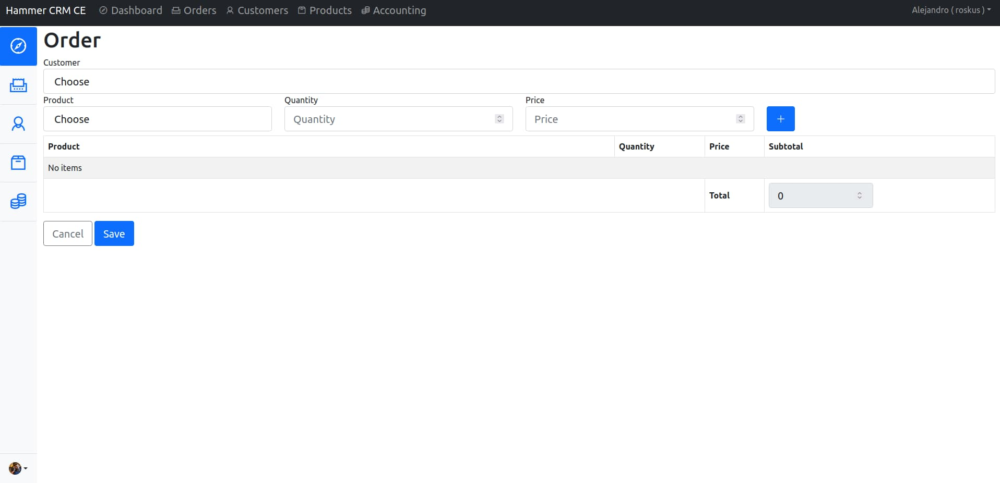

# Hammer CRM
We made a free open source CRM. Our Community Edition (CE) Hammer CRM is based in Laravel 8

## Features
* Multi company (White label)
* Multi language
* REST API

## Setup

* Clone:
* git ```git clone git@github.com:Roskus/hammercrm.git```
* Run: ```composer install```
* Check permissions
* Run ```cp .env.example .env```
* Edit .env set language, database.
* Run ```php artisan key:generate```
* Run ```php artisan migrate```
* Generate JWT Secret ```php artisan jwt:secret```

## Demo

User: admin@admin.com

Pass: admin

## API
We will provide a REST API for exchange information with the CRM

Endpoint:
/api

For example:

GET /api/customers

## Resources
Icon font Line Awesome
https://icons8.com/line-awesome
